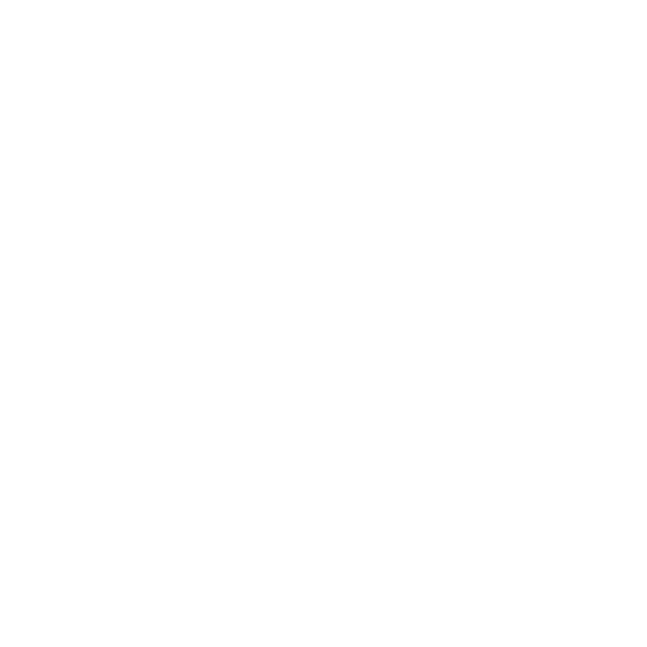
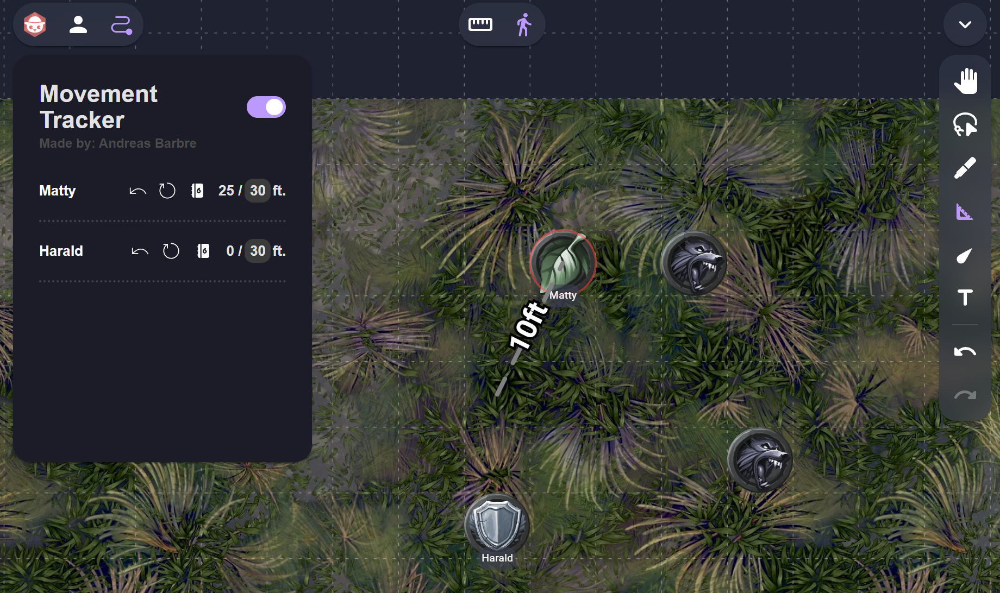

# Movement Tracker

An easy way to keep track of your used movement in combat. Both as a Player, and as a GM controlling NPC's and Enemies

## Features

Select your character token/tokens and click the button  to add them to the movement tracker, and get moving!

### No more exceeding your movement speed

In case you ever move too long, the extension will automaticly remind you and reverse your postion.

#### Using dash or spell? No problem!

If you're ever using dash, or any kind of spell, that gains you extra movement. Just tap the _using spell_ button  and it bypasses the movement restriction.

### A tool for both GM's and Players

The tracker is designed to both help the GM with controlling the Enemies and NPC's, and Players controlling thier character, without spoiling the speed of the GM's Enemies. The GM has to option to privately track his entities, which makes them only visible for him. His privately tracked entities will then have a different font color, and sorted at the top of his list, so the they are easily accesible for the GM to manage. He can also reset the movement of all GM enteties at once

### Realtime updates

Everything in the UI is updated i realtime between players. So players easily can work together to claim victory!

### Use in combination with Owlbears measure tool for a seamless experience!

Double tap **M** for a seamless experience

## Support

If you need support for this extension or have any ideas for new features, you message **barbre** on discord, or email me at <ao.barbre@gmail.com>
